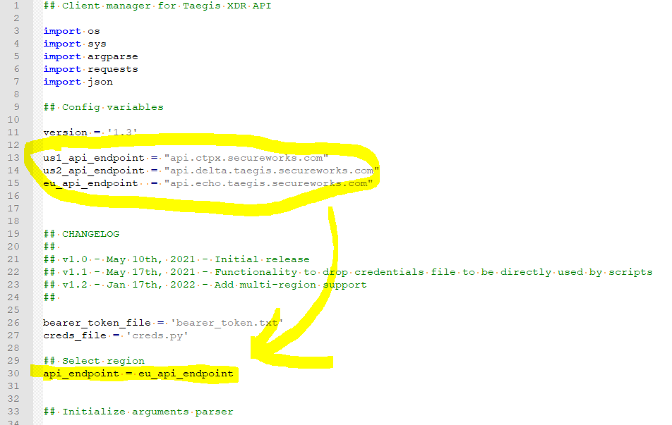

# Taegis XDR API Client manager

Handy command line method to GET, CREATE, LIST, DELETE, ROTATE and DELETEALL API clients.

The script uses a bearer ACCESS TOKEN stored in a file (bearer_token.txt) in the working directory.
If there is no such file, the script will ask the user to supply an ACCESS TOKEN which will be written to the file.

For an ACCESS TOKEN, please follow steps 1-3 in https://docs.ctpx.secureworks.com/apis/api_authenticate/

## Configure script with correct region

Line 30 of the script needs to be updated with the correct instance location (US1, US2 or EU).

**NOTE: All client IDs and secrets shown in this page have been revoked, and the bearer token has been obscured in the screenshots, don't bother trying :)**

## Create API client

Takes a client name as parameter and creates an API client. 
The client secret will be returned and never shown again. Make a copy of the client id and client secret so you can use it in your API code.

**taegis-xdr-api-client.py CREATE** *client_name*

The script will ask you if you want to write a file with the tenant id, client id and secret.

## Get list of API clients

Retrieves the list of API clients to which you have access to.

**taegis-xdr-api-client.py LIST**

## Get API clients details

Retrieves details of specific API client using its ID (please use the ID not the CLIENT ID)

**taegis-xdr-api-client.py GET** *id*

## Delete API client

Delete API client using its ID (please use the ID not the CLIENT ID)

**taegis-xdr-api-client.py DELETE** *id*

## Rotate API client (ie. generate new secret)

Rotates the API client secret using its ID (please use the ID not the CLIENT ID)

**taegis-xdr-api-client.py ROTATE** *id*

## Delete all API clients (use with caution)

Deletes all API clients you have access to. Please note that the command requires a second argument of "yes" in the command-line to avoid accidents.

**taegis-xdr-api-client.py DELETEALL YES**

