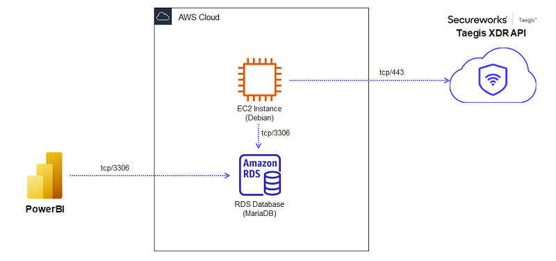
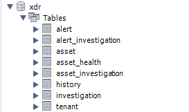
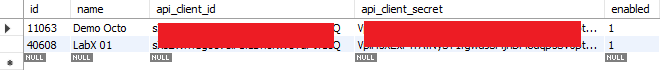
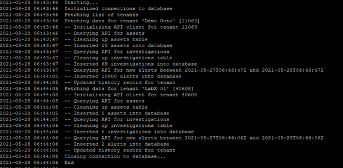
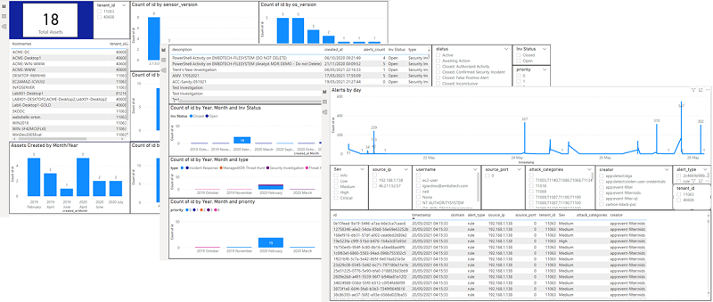

# Taegis XDR Reporter

This is a sample project to demonstrate adding reporting capabilities with PowerBI to Taegis XDR, created by Kristy Cyr and Alfredo Reino.

The gaps addressed are:

- No flexible reporting/dashboard functionality in Taegis XDR for the more compliance-oriended customers.
- GraphQL API is rich but not easy or intuitive to consume from Excel/PowerBI for most users.

The project consists of:

- A script which connects periodically to the Taegis XDR GraphQL API, using tenant-specific credentials, and queries Assets, Investigations and Alerts, and writes everything to the relational database.
- A relational database which stores all imported data.
- A PowerBI file that uses the relational database as source to display graphs, slicers and lists and present Taegis XDR data in flexible and easy to use ways.

*NOTE: Individual "events" from Taegis XDR are not available as of today through the API.*

## Requirements

- Access to a Taegis XDR tenant
- API credentials to that tenant (see )
- Relational database, MySQL/MariaDB
- Ability to run Python 3.x scripts

The proof-of-concept created uses AWS RDS (serverless MariaDB) together with a nano EC2 instance to run the script, as shown in the diagram below.

Either you deploy a Linux box with the database AND the script and a crontab job, or you can create a container, or use serverless elements in Azure/AWS. 
Just be mindful of the fact that **the database stores API credentials, so don't expose them**.

## Database

The database as a pretty straight-forward schema, to store Assets, Investigations and Alerts, as well as their relationship.

For the script to work, the table "tenant" must be populated with the tenant id, a name for the tenant, and the API credentials that the script will be using to pull information from the Taegis XDR API. Please note that read-only credentials to the API are sufficient. Do not use "Secureworks Analyst" or any other superuser role.

## Script

The script is called import.py, and it needs to be called periodically (for example from a crontab), typically every 24 hours.

The script has the following dependencies:

- The module pymysql (pip install pymysql)
- The module taegis (just put the taegis.py from [this repository](https://code.8labs.io/alreino/taegis-xdr-api-python-module) into the same folder)
- A file called creds.py with the variables needed for the database connection

## The PowerBI file

See the repository files for an example PowerBI file consuming data from Assets, Investigations and Alerts.

